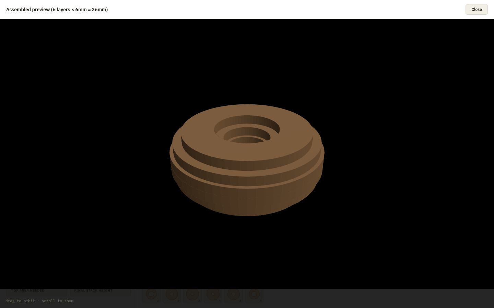
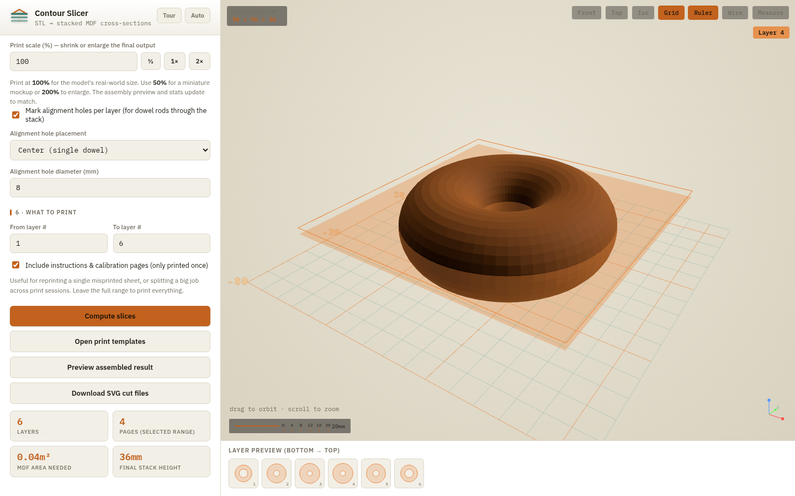
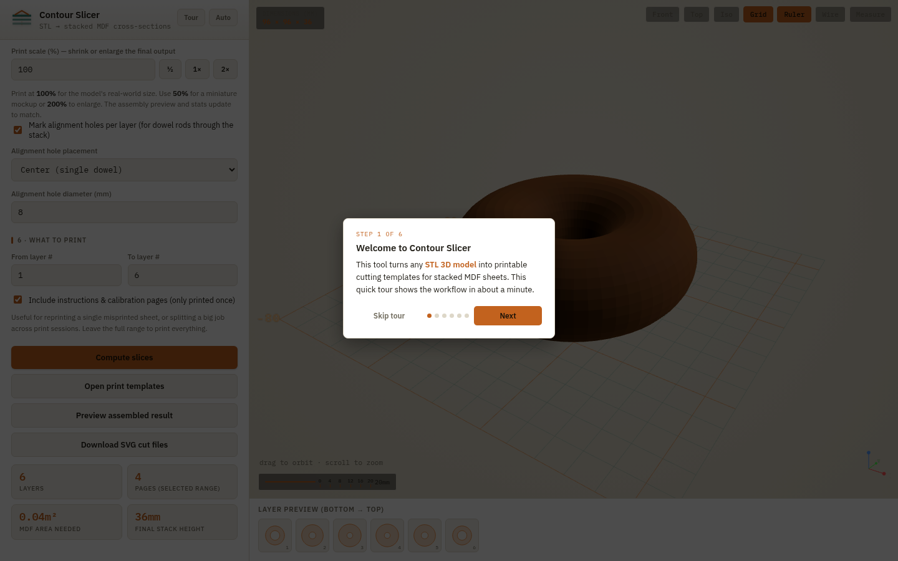
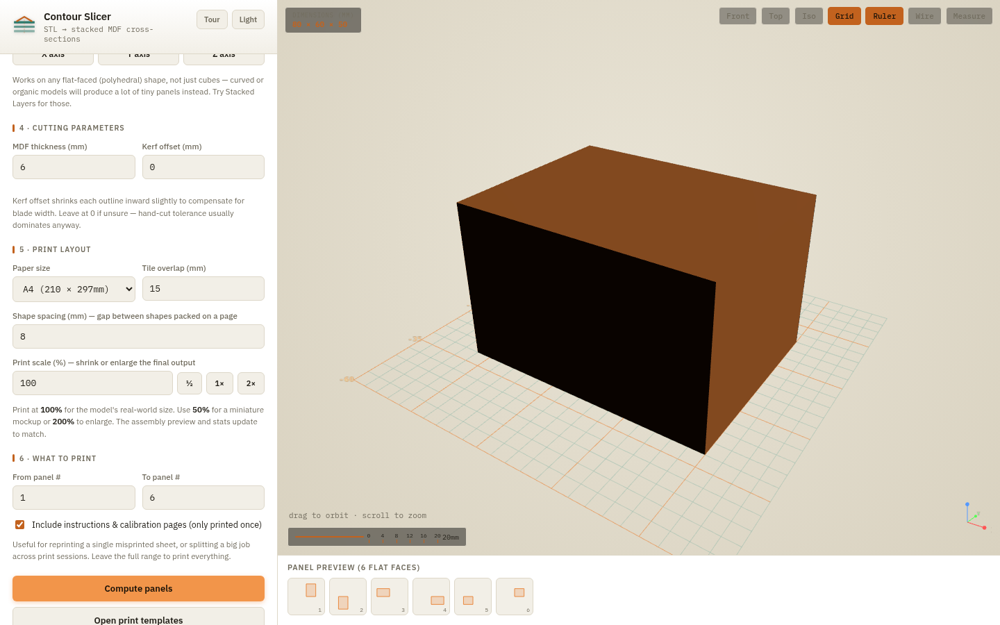
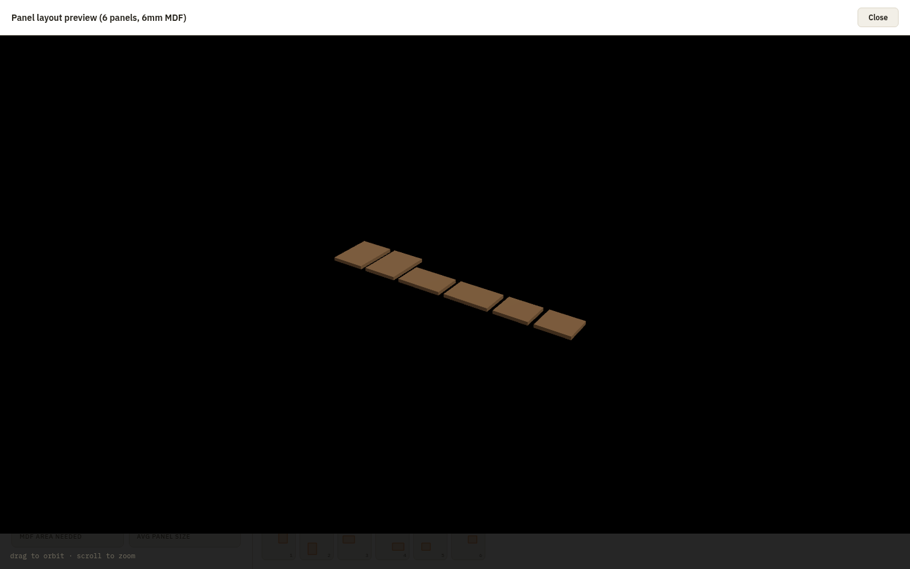
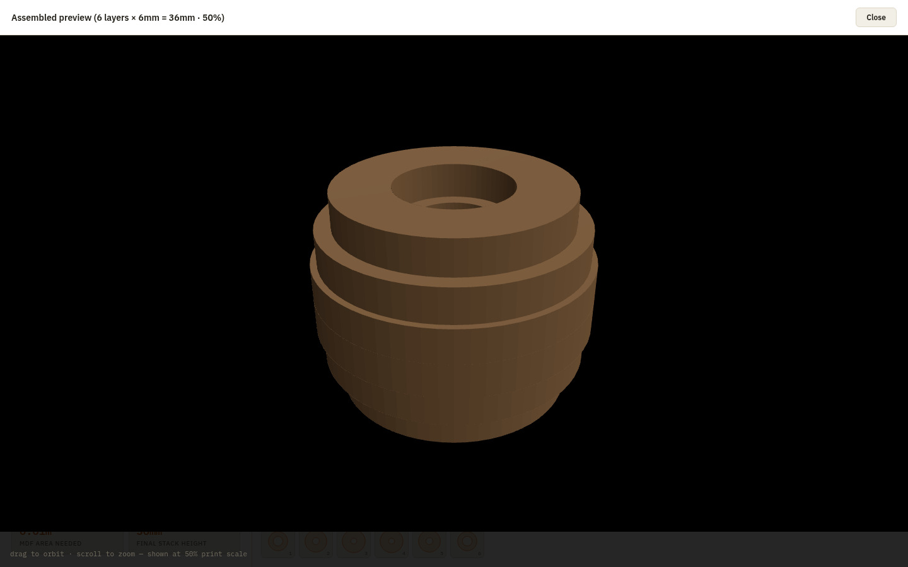

# Contour Slicer

**Turn any 3D model into printable cutting templates for stacked MDF — no CNC, no 3D printer required.**

Contour Slicer takes an STL file and slices it into horizontal cross-sections, then lays those cross-sections out as print-to-paper templates. You print them, spray-mount onto MDF, cut with a jigsaw or scroll saw, and glue the stack together. It's the fastest way to go from a 3D file to a real physical object when you don't have a CNC router or 3D printer — or when you just need a quick mockup and don't want to wait hours for a print.

---

## Why this exists

Not everyone has a CNC machine or a 3D printer. But almost everyone has:

- A printer
- A jigsaw or scroll saw
- Sheets of MDF (cheap, available at any hardware store)
- Spray adhesive or glue stick

Contour Slicer bridges the gap between digital 3D models and physical objects using only those basic tools. It's perfect for:

- **Rapid mockups & prototypes** — go from STL to a physical object in under an hour
- **Makers without a 3D printer** — build large objects that wouldn't fit on a printer bed anyway
- **Sculptors & prop makers** — create organic forms by stacking and sanding layered cross-sections
- **Educators** — demonstrate how 3D models can be decomposed into 2D manufacturing steps
- **Big objects** — a 200mm tall model needs 33 sheets of 6mm MDF; good luck printing that on an Ender 3

*The assembly preview shows exactly what your glued-up stack will look like before you cut a single piece.*

---

## How it works

1. **Load an STL** — drag in a file, or try the built-in Ring or Box examples (no download needed)
2. **Pick a decomposition mode** — *Stacked Layers* for organic shapes, *Flat Panels* for boxy shapes
3. **Set the scale** — use the model's native units, or force it to a specific height
4. **Set MDF thickness** — defaults to 6mm (the most common sheet)
5. **Compute slices** — the app calculates every cross-section automatically
6. **Preview the result** — see a 3D mockup of the assembled stack
7. **Print or export** — print to paper (small shapes are packed multiple-per-page to save paper), or download SVG files for a laser cutter

*Hover any layer thumbnail to see exactly where that slice falls on the 3D model.*

---

## Features

### Two decomposition modes

- **Stacked Layers** — slices the model into horizontal cross-sections, one per MDF sheet. Best for rounded, organic, or sculptural shapes. Stack and glue them in order for a faithful reproduction.
- **Flat Panels** — extracts each flat face as a separate panel. Best for boxy shapes (crates, housings, geometric forms). Cut and glue edge-to-edge like assembling a box.

### Smart print layout

Small shapes are automatically **packed multiple-per-page** to save paper. A 6-layer ring model that used to need 6 pages now fits on 2. Shapes larger than one page are tiled across pages with alignment crosses for taping together.

### Print scale

Need a miniature? Set the print scale to **50%** and every cut outline shrinks proportionally — the calibration ruler on the cover page scales too, so you can verify it printed correctly. Want something bigger? Crank it to **200%**. The assembly preview and stats update live.

### Assembly preview

Before cutting anything, click **Preview assembled result** to see a 3D rendering of the finished stack. Each layer is extruded to the MDF thickness and stacked at its correct height. For flat-panel mode, all panels are laid out so you can see every piece.

### Viewer tools

- **Grid & Ruler** — adaptive ground grid with major/minor lines and numeric labels; graduated scale bar with tick marks
- **Dimensions readout** — real-world W × D × H in mm, always visible
- **Axis gizmo** — colored X/Y/Z tripod in the corner so you never lose orientation
- **View presets** — Front, Top, Isometric (keys 1/2/3)
- **Wireframe** — see through the model to internal structure (key W)
- **Measure** — click two points on the model to get the distance in mm (key M)
- **90° rotation** — rotate the model in-app if it's on its side (no need to go back to Tinkercad)
- **Layer hide/show** — click a thumbnail to toggle a layer's visibility

### Alignment holes

Optionally mark alignment holes on each layer — either a single center hole or four corner holes. Drill these before removing the paper template, then thread a dowel rod through the stack to keep everything registered while the glue sets.

### SVG export

For laser cutters or CNC routers, download all layers as a single SVG file (one `<g>` per layer, in millimeters). The filename includes the scale percentage so you can keep track of different versions.

### Guided walkthrough

First-time users get a 6-step spotlight tour that highlights the key controls. It auto-starts on first visit and can be re-triggered anytime via the **Tour** button.

### Light & dark themes

Follows your OS preference by default, with a manual override that persists across sessions. No flash of the wrong theme on reload.

---

## Getting started

### Option A: Download and run (recommended)

1. Download `contour-slicer-6.html`
2. Open it in any modern browser (Chrome, Firefox, Safari, Edge)
3. That's it — no install, no server, no dependencies

The app needs an internet connection **only the first time** it runs, to load the 3D engine (three.js) from a CDN. After that, the browser caches it and you can use the app offline.

### Option B: Try the examples first

Don't have an STL handy? Click **Ring (has a hole)** or **Box (flat faces)** on the model section to load a generated example. The ring is a great test of the stacked-layers mode (it has interior holes); the box is a great test of flat-panel mode.

---

## Where to get STL files

- **Tinkercad** (free, browser-based) — design simple shapes or remix community models, export as STL
- **Thingiverse** / **Printables** / **MakerWorld** — millions of free models, download as STL
- **Scan the World** — museum sculptures and artworks, ready to slice
- **Blender** / **Fusion 360** / **Onshape** — design your own from scratch

---

## Cutting & assembly tips

1. **Print at 100% scale** — make sure "Fit to page" is OFF in your print dialog. The calibration page has a 100mm ruler mark — measure it to verify.
2. **Spray-mount the template** onto the MDF. Spray adhesive or glue stick both work.
3. **Cut the outline** with a jigsaw or scroll saw. Cut any interior (hole) outlines too.
4. **Drill alignment holes** (if enabled) before removing the paper.
5. **Stack in numeric order** (layer 1 = bottom). Thread a dowel rod through the alignment holes to keep things registered.
6. **Glue between layers**, clamp, and let it set.
7. **Sand the stepped edge** smooth, or leave it faceted for a layered look.

For large objects that span multiple pages per layer, trim along the overlap lines and tape adjacent sheets together first, matching the alignment crosses.

---

## Technical details

- **Single HTML file** — everything (HTML, CSS, JS) is in one self-contained file. No build step, no node_modules, no framework.
- **Three.js** for 3D rendering and STL parsing, loaded from CDN.
- **Runs entirely in the browser** — your STL files never leave your computer. No upload, no server, no tracking.
- **Works offline** after first load (CDN is cached).
- **Mobile-friendly** — responsive layout, touch-optimized controls, safe-area insets for notched phones.

---

## Keyboard shortcuts

| Key | Action |
|-----|--------|
| `G` | Toggle grid |
| `R` | Toggle ruler |
| `W` | Toggle wireframe |
| `M` | Toggle measure tool |
| `1` | Front view |
| `2` | Top view |
| `3` | Isometric view |
| `Esc` | Close modal / clear measurement |

---

## Screenshots

### Main interface with grid, ruler, and dimensions

### Assembly preview — see the glued-up stack before cutting

### Guided walkthrough

### Slice-plane preview — hover a layer to see where it falls

### Light mode

### Flat-panel mode for boxy shapes

### Panel layout preview

### Print scale at 50% — miniature mockup

---

## License

MIT — do whatever you want with it. Build things, sell things, learn things.

---

## Credits

Built with [Three.js](https://threejs.org/). Fonts: IBM Plex Sans & Mono.
